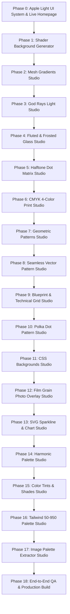

# MagicPattern Suite - Structured Build Phases & Roadmap

This document outlines the phased roadmap to rebuild the complete MagicPattern design suite with Apple Design Principles, a light UI, a homepage with live interactive previews, and 17 precision reverse-engineered tools.

---

## 📋 Master Phase Checklist

---

## 阶段 0 (Phase 0): Apple Light UI System & Live Homepage Directory
- [x] **Design Tokens & Theme**:
  - Pure Apple Light Palette: Canvas `#F5F5F7`, Surface `#FFFFFF`, Border `#E5E5EA`, Text `#1D1D1F`, Subtext `#86868B`, Accent `#0071E3`.
  - Typography: SF Pro / Inter typography hierarchy with tight letter tracking.
  - Controls: Native Apple-style sliders, segmented pill switches, compact input boxes.
- [x] **Apple Navigation Header**:
  - MagicPattern logo mark, "← All Tools" back button when inside a tool studio, active tool title, search trigger (`⌘K`), clean export triggers.
- [x] **Homepage & Tools Directory View**:
  - Curated directory grid of the **17 designated tools**.
  - **Live Procedural Visual Previews**: Each card runs a lightweight live canvas/SVG renderer showing a real preview of its generator.
  - Category filters: `All (17)`, `Shaders & Gradients (4)`, `Patterns & Textures (8)`, `Color Tools (4)`, `SVG & Charts (1)`.
  - Instant search bar with real-time tag and name filtering.
  - Seamless view routing: Clicking any card opens that tool's full-screen editor with zero reload delay.

---

## 阶段 1 (Phase 1): Shader Background Generator
- **URL**: `https://www.magicpattern.design/tools/shader-background-generator`
- [ ] GLSL fragment shader with `modulatedSquareWave`, `fastTanh`, 2D coordinate displacement warp.
- [ ] Bayer $4 \times 4$ dithering matrix with configurable bit depth levels (2–64) and pixel scaling.
- [ ] Dynamic hash film grain, smoothstep radial edge vignette, Rodrigues' hue rotation.
- [ ] 2 to 6 color stops palette manager with 100+ designer palettes shuffle.
- [ ] 15 authentic MagicPattern presets library (Ultraviolet Dream, Blue Waves, Aurora, Sunset, Midnight, etc.).
- [ ] Video timeline keyframe mode: scrubber, play/pause, loop toggle, easing curves (Linear, EaseIn, EaseOut, EaseInOut).
- [ ] Multi-format high-res exports: PNG/JPG/WebP at 1x, 2x, 4x, WebM/MP4 video sequence, React component, GLSL shader code, CSS fallback.

---

## 阶段 2 (Phase 2): Mesh Gradients Studio
- **URL**: `https://www.magicpattern.design/tools/mesh-gradients`
- [ ] Interactive 2D coordinate canvas with 4 to 9 draggable control points.
- [ ] Gaussian radial gradient interpolation and smooth spatial color blending.
- [ ] Point controls: coordinate position $(x, y)$, individual color picker, opacity.
- [ ] Global blur slider (10px–200px), mesh distortion jitter, aspect ratio presets (16:9, 1:1, 9:16, Wallpaper).
- [ ] Randomize point positions and color harmonies with spacebar.
- [ ] Exports: 4K PNG, SVG vector mesh markup, CSS radial-gradient code.

---

## 阶段 3 (Phase 3): God Rays & Sunbeam Generator
- **URL**: `https://www.magicpattern.design/tools/god-rays-generator`
- [ ] Volumetric light ray scattering with exponential falloff decay.
- [ ] Origin coordinate controls ($X, Y$), ray count (12 to 96), light exposure (0.2 to 3.0), ray decay (0.5 to 0.99).
- [ ] Ray tint color and dark background color pickers.
- [ ] Animated floating dust motes particle density toggle.
- [ ] Exports: 4K PNG, SVG vector rays, WebGL shader snippet.

---

## 阶段 4 (Phase 4): Fractal & Fluted Glass Studio
- **URL**: `https://www.magicpattern.design/tools/fractal-glass-effect`
- [ ] Fluted vertical cylinder normal mapping, surface frosted noise, and chromatic aberration color displacement.
- [ ] Style options: Fluted ribs, Frosted glass, Fractal distortion.
- [ ] Rib frequency (8–80), refraction intensity (0.1–1.5), specular highlight brightness.
- [ ] Custom background image upload or procedural gradient backdrop.
- [ ] Exports: High-res PNG with alpha channel, React component.

---

## 阶段 5 (Phase 5): Halftone Dot Matrix Generator
- **URL**: `https://www.magicpattern.design/tools/halftone-generator`
- [ ] Luminance sampling of uploaded photos or procedural gradients mapped to dot diameter.
- [ ] Dot shapes: Circle, Square, Diamond, Line raster.
- [ ] Pitch spacing (8–50px), dot diameter (4–40px), screen angle (0°–90°), contrast curve (0.5–2.5).
- [ ] Foreground dot color, background color, and photo upload support.
- [ ] Exports: High-res PNG, Scalable SVG vector file.

---

## 阶段 6 (Phase 6): CMYK Offset Print Halftone
- **URL**: `https://www.magicpattern.design/tools/cmyk-halftone`
- [ ] Authentic 4-color process (Cyan, Magenta, Yellow, Key/Black) separation.
- [ ] Offset printing rosette angles: Cyan $15^\circ$, Magenta $75^\circ$, Yellow $0^\circ$, Black $45^\circ$.
- [ ] Dot pitch, contrast gain, channel balance.
- [ ] Exports: High-res PNG, 4-color separated SVG layers.

---

## 阶段 7 (Phase 7): Geometric Patterns Generator
- **URL**: `https://www.magicpattern.design/tools/geometric-patterns`
- [ ] Mathematical geometric tessellations: Isometric 3D cubes, equilateral triangles, hexagons, interlocking scales, octagons.
- [ ] Tile size (20px to 200px), stroke thickness, 2-3 palette colors, fill mode.
- [ ] Exports: SVG pattern file, CSS background code, PNG.

---

## 阶段 8 (Phase 8): Seamless Patterns Generator
- **URL**: `https://www.magicpattern.design/tools/seamless-patterns`
- [ ] Seamless vector tile repeater with boundary edge wrapping and randomized distribution.
- [ ] Motif library (circles, crosses, stars, squiggles, badges, pills), grid spacing, rotation jitter, color palette.
- [ ] Exports: Seamless tileable SVG file, CSS `background-repeat` code, PNG.

---

## 阶段 9 (Phase 9): Grid & Blueprint Pattern Generator
- **URL**: `https://www.magicpattern.design/tools/grid-background-pattern-generator`
- [ ] Multi-tier technical blueprint, graph paper millimeter subdivisions, and dot matrix axes.
- [ ] Grid theme (Blueprint, Millimeter Graph, Dot Grid), major grid size (40–200px), minor subdivisions (2–10), major line color, minor line color, background color, coordinate numbers toggle.
- [ ] Exports: CSS background snippet, SVG vector asset, PNG.

---

## 阶段 10 (Phase 10): Polka Dot Pattern Generator
- **URL**: `https://www.magicpattern.design/tools/polka-dot-pattern-generator`
- [ ] Square and hexagonal staggered polka dot matrix with size variance and jitter.
- [ ] Dot radius (2–30px), spacing / pitch (10–100px), layout mode (Square grid vs Staggered Hex), dot color, background color, opacity.
- [ ] Exports: CSS background declaration, SVG file, PNG.

---

## 阶段 11 (Phase 11): CSS Backgrounds Studio
- **URL**: `https://www.magicpattern.design/tools/css-backgrounds`
- [ ] Full CSS background suite: Diagonal Stripes, Polka Dots, Grid Lines, Checkerboard, Crosshatch, Zig-zag Chevron, Wave curves.
- [ ] Tile dimensions, stroke weight, angle, foreground/background colors.
- [ ] Exports: One-click copy CSS background code, SVG file, PNG.

---

## 阶段 12 (Phase 12): Add Grain & Film Noise to Images
- **URL**: `https://www.magicpattern.design/tools/add-grain-to-images`
- [ ] Analog 35mm film grain, per-pixel luminance noise, Gaussian distribution with blend mode compositing.
- [ ] Noise intensity (0–100%), grain roughness / scale (1–6px), monochromatic vs color noise, blend mode (Overlay, Soft Light, Screen, Multiply), image upload support.
- [ ] Exports: Processed high-res PNG image.

---

## 阶段 13 (Phase 13): SVG Sparkline & Chart Generator
- **URL**: `https://www.magicpattern.design/tools/svg-chart-generator`
- [ ] Smooth cubic bezier spline interpolation for data visualization curves.
- [ ] Chart type: Area fill, Smooth line sparkline, Bar chart.
- [ ] Data points editor / randomize, stroke thickness, line color, gradient fill color, data point dots toggle, smooth curve toggle.
- [ ] Exports: Pure SVG markup, React component, PNG.

---

## 阶段 14 (Phase 14): Harmonic Color Palette Generator
- **URL**: `https://www.magicpattern.design/tools/color-palette-generator`
- [ ] HSL color wheel harmonies: Complementary ($180^\circ$), Analogous ($\pm 30^\circ$), Triadic ($120^\circ$), Tetradic ($90^\circ$), Monochromatic (luminance stepping).
- [ ] Base anchor color, harmony rule selector, individual color lock/unlock toggles, spacebar randomize, contrast ratio indicators (WCAG 2.1).
- [ ] Exports: Hex codes list, CSS variables (`:root`), JSON, Tailwind color object.

---

## 阶段 15 (Phase 15): Color Tints, Shades & Tones Generator
- **URL**: `https://www.magicpattern.design/tools/color-tints-shades-generator`
- [ ] Precise color ramp stepping: Tints (interpolated with white `#FFF`), Shades (interpolated with black `#000`), Tones (interpolated with neutral gray `#808080`).
- [ ] Base hex color, ramp steps count (5 to 21 steps), step distribution curve.
- [ ] Exports: Hex array, CSS variables, JSON.

---

## 阶段 16 (Phase 16): Tailwind Color Palette Generator
- **URL**: `https://www.magicpattern.design/tools/tailwind-color-palette-generator`
- [ ] Luminance-calibrated 50, 100, 200, 300, 400, 500, 600, 700, 800, 900, 950 shade generation.
- [ ] Base color input (500 anchor), palette key name, lightness / chroma curve fine-tuning.
- [ ] Exports: Copy-pasteable `tailwind.config.js` color object, CSS variables.

---

## 阶段 17 (Phase 17): Extract Palette from Image
- **URL**: `https://www.magicpattern.design/tools/extract-palette-from-image`
- [ ] Canvas pixel sampling and color quantization to isolate dominant, vibrant, dark, and pastel hues.
- [ ] Drag-and-drop image upload, sample count (4 to 8 colors), sample density, copy hex code on click.
- [ ] Exports: Hex color list, CSS theme snippet, JSON.

---

## 阶段 18 (Phase 18): End-to-End QA & Production Build
- [ ] Complete functional audit of all 17 tools.
- [ ] Cross-browser verification and responsive layout validation.
- [ ] Production build (`npm run build`) passing with zero TypeScript and bundling errors.
